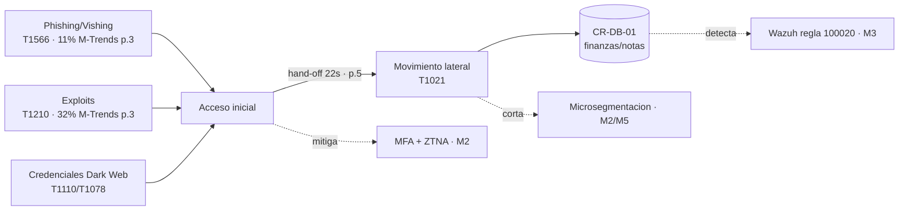

# Módulo 1 — Panorama de Amenazas y relación con el caso CREATIC

> **Peso en la rúbrica: 15%** (junto con M6). Fuentes: **Mandiant M-Trends 2026** (Edición
> Ejecutiva, Mandiant/Google Cloud) + fuente secundaria **CISA**. Marco de mapeo de adversarios:
> **MITRE ATT&CK**.

> **Sobre las citas de Mandiant.** Las cifras citadas provienen de la **Edición Ejecutiva** del
> informe M-Trends 2026 (12 páginas, descarga gratuita de Google Cloud). Los números de página
> corresponden a esa edición. Si tu profesor exige el **informe completo** (~150 págs), descárgalo
> también desde el mismo portal y ajusta los números de página; las cifras son las mismas.
> **Descarga gratuita:** `https://cloud.google.com/security/resources/m-trends` (edición ejecutiva
> directa: `https://services.google.com/fh/files/misc/m-trends-2026-executive-edition-en.pdf`).

---

## 1. Panorama de amenazas actual (datos M-Trends 2026)

El informe **M-Trends 2026** de Mandiant (basado en **450,000 horas** de respuesta a incidentes
durante 2025) describe un ecosistema de amenazas que coincide punto por punto con lo que sufrió
CREATIC:

| Hallazgo M-Trends 2026 | Cifra | Cita | Relevancia para CREATIC |
|---|---|---|---|
| Vector de acceso inicial #1: **explotación de vulnerabilidades** | **32%**, 6.º año consecutivo | *M-Trends 2026 Ed. Ejecutiva, p. 3* | CREATIC tiene servidores **sin parches** (CR-DC-01, 6 meses) y **SMBv1** activo → blanco directo |
| 2.º vector: **vishing (phishing de voz)** | **11%** (subió) | *Ed. Ejecutiva, p. 3* | Ingeniería social a docentes; el spear-phishing fue el vector real de CREATIC |
| Email phishing en descenso pero vigente | 14% (2024) → **6%** (2025) | *Ed. Ejecutiva, p. 3* | Justifica MFA resistente a phishing (M2) |
| **Dwell time** global (permanencia del atacante) | **14 días** (subió desde 11) | *Ed. Ejecutiva, p. 2–3* | Sin SOC, CREATIC no detectaría la intrusión durante ~2 semanas → urgencia de Wazuh (M3) |
| Detección: interna vs. notificación externa | **52% interna** / 34% externa / 14% por el adversario | *Ed. Ejecutiva, p. 3* | Un SOC propio (Wazuh) sube la detección interna y reduce el MTTD |
| **"Time to Hand-Off" colapsó** | de >8 h (2022) a **22 segundos** (2025) | *Ed. Ejecutiva, p. 5* | Los *initial access brokers* venden el acceso en segundos → hay que **contener y detectar rápido** (Zero Trust + SIEM) |
| Motivación: financiera vs. espionaje | **41% financiera** / 16% espionaje | *Ed. Ejecutiva, p. 3* | Las finanzas y calificaciones de CR-DB-01 son blanco económico atractivo |

> **Fuente secundaria (CISA):** los avisos de CISA para el sector educativo (K-12 / Higher Ed)
> coinciden en priorizar **MFA, segmentación de red y monitoreo de logs** como controles de mayor
> impacto-costo — exactamente los ejes de este proyecto. *(Completar con el aviso/URL específico de
> CISA que cites; p. ej. la guía "Online Safety / K-12 Cybersecurity" de CISA.)*

---

## 2. Lectura del caso CREATIC a la luz de M-Trends 2026

Los incidentes que ya sufrió CREATIC son una instancia local de las tendencias globales:

- **Spear-phishing exitoso a docentes** → coincide con el peso del phishing/vishing como vector
  inicial (*p. 3*). El factor humano es la puerta de entrada.
- **Credenciales administrativas en la Dark Web** → alimenta el *credential stuffing* y el uso de
  *cuentas válidas*; combinado con el mercado de *initial access brokers* (hand-off de 22 s, *p. 5*),
  una credencial filtrada se convierte en intrusión casi instantánea.
- **Ransomware en equipos remotos** → habilitado por SMBv1 y la falta de EDR; el dwell time de 14
  días (*p. 2–3*) explica por qué el daño escala antes de ser detectado.
- **Red plana sin control** → facilita el movimiento lateral que sigue a la explotación inicial.

---

## 3. Mapeo de los 3 vectores del caso a MITRE ATT&CK

El enunciado exige mapear **phishing avanzado**, **credential stuffing** y **movimiento lateral**.
Se traducen a técnicas concretas de MITRE ATT&CK, cada una con su control en el proyecto:

### 3.1 Phishing avanzado (Acceso Inicial)

| Táctica / Técnica ATT&CK | Cómo aplica a CREATIC | Control que lo mitiga |
|---|---|---|
| **TA0001 Initial Access** → **T1566** Phishing (.001 adjunto / .002 enlace) | Spear-phishing y vishing a docentes | MFA resistente a phishing (M2), filtrado de correo, concienciación |
| **T1204** User Execution | El docente abre el adjunto/enlace malicioso | EDR Wazuh en endpoint (M3), control de postura (M2) |

### 3.2 Credential stuffing / cuentas válidas

| Táctica / Técnica ATT&CK | Cómo aplica a CREATIC | Control que lo mitiga |
|---|---|---|
| **T1110.004** Credential Stuffing | Reúso de credenciales filtradas en la Dark Web | MFA (M2) + **regla Wazuh 100010** (M3) |
| **T1078** Valid Accounts | Credenciales admin comprometidas usadas como acceso legítimo | Mínimo privilegio + MFA (M2), alertas de uso anómalo (M3) |
| **T1133** External Remote Services | Acceso por la VPN PPTP/L2TP insegura | Reemplazo por ZTNA + postura (M2) |

### 3.3 Movimiento lateral (Post-explotación)

| Táctica / Técnica ATT&CK | Cómo aplica a CREATIC | Control que lo mitiga |
|---|---|---|
| **TA0008 Lateral Movement** → **T1021** Remote Services | Pivote del web server a la BD en la red plana | **Microsegmentación VLAN** (M2) + `ufw` (M5) |
| **T1210** Exploitation of Remote Services | Explotar SMBv1 / servicios expuestos | SMBv1 deshabilitado (M5) + **regla Wazuh 100030** (M3) |
| **T1570** Lateral Tool Transfer | Mover herramientas entre hosts | NGFW egress + segmentación (M2) |

> Esta tabla es el **puente amenaza→arquitectura**: cada técnica del adversario tiene un control
> nombrado y un archivo del repo que lo implementa (ver `plan/matriz-trazabilidad.md`).

---

## 4. Evaluación de la triada CIA de los activos críticos

Impacto potencial sobre **Confidencialidad (C)**, **Integridad (I)** y **Disponibilidad (D)** de
cada activo (escala Bajo/Medio/Alto/Crítico):

| Activo | Datos / función | C | I | D | Justificación del impacto |
|---|---|:--:|:--:|:--:|---|
| **CR-DB-01** (MySQL finanzas/notas) | Calificaciones y finanzas | **Crítico** | **Crítico** | Alto | Una fuga viola privacidad (Ley 81); alterar notas/finanzas es fraude |
| **CR-DC-01** (DC/DNS/DHCP) | Identidad del dominio | Alto | **Crítico** | **Crítico** | Comprometer el DC = control total; su caída paraliza todos los servicios |
| **CR-APPSRV-02** (Portal web) | Servicio académico expuesto | Medio | Alto | Alto | Cara expuesta a Internet; su compromiso es el trampolín al resto |
| **CR-FILE-03** (archivos admin) | Documentos administrativos/RR.HH. | Alto | Alto | Medio | Permisos "Everyone" exponen la confidencialidad de datos sensibles |

**Lectura Zero Trust:** los activos con C/I **crítico** (CR-DB-01, CR-DC-01) son los que más se
benefician de microsegmentación, cifrado y MFA. La triada CIA justifica priorizarlos y alimenta
directamente la **matriz de riesgos del Módulo 7**.

---

## 5. Resumen de controles del Módulo 1 (para la matriz de trazabilidad)

- Inteligencia de amenazas → M-Trends 2026 (p. 2–5) + CISA → este documento
- Mapeo de TTPs → MITRE ATT&CK → tablas §3 + reglas Wazuh (M3)
- Evaluación CIA → base de priorización → alimenta M7 (matriz de riesgos)

**Sources / referencias web consultadas:**
- [M-Trends 2026 — Google Cloud Blog](https://cloud.google.com/blog/topics/threat-intelligence/m-trends-2026)
- [M-Trends 2026 Executive Edition (PDF)](https://services.google.com/fh/files/misc/m-trends-2026-executive-edition-en.pdf)
