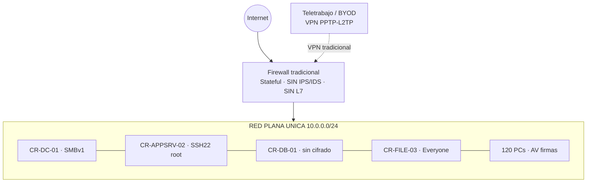
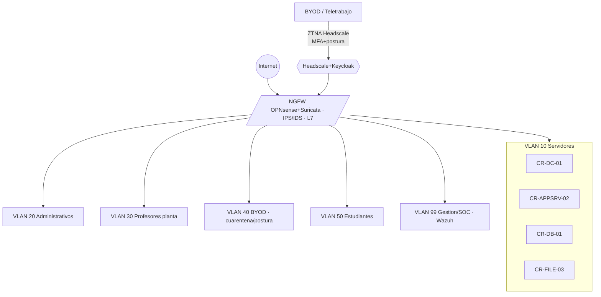
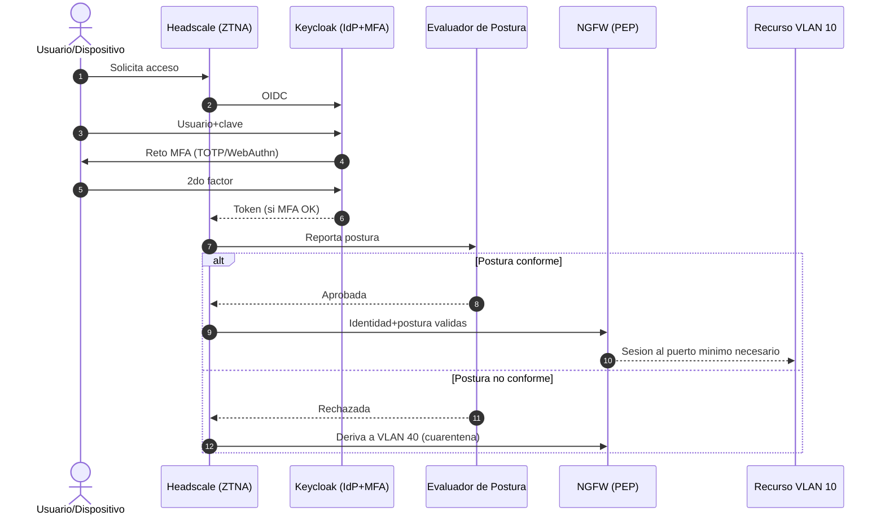

# Módulo 2 — Arquitectura de Red Moderna (Zero Trust & SASE)

> **Peso en la rúbrica: 25%** (Diseño de Arquitectura Zero Trust y Viabilidad Económica).
> Marcos de referencia: **NIST SP 800-207** (Zero Trust Architecture) y
> **CISA Zero Trust Maturity Model v2.0**. Todo el stack es Open Source ($0).

---

## 1. Principios rectores (NIST SP 800-207)

La junta directiva de CREATIC declaró obsoleto el modelo de "perímetro de castillo". El
rediseño se basa en los tres axiomas de Zero Trust:

1. **Verificar continuamente** — ninguna conexión se confía por su origen de red; cada acceso
   se autentica (MFA) y se autoriza por política, y se **reevalúa** durante la sesión.
2. **Mínimo privilegio** — cada usuario/dispositivo accede solo al recurso y puerto que
   necesita. El tráfico entre segmentos pasa **siempre** por el NGFW.
3. **Asumir la brecha** — se segmenta para que un compromiso quede contenido (radio de
   explosión mínimo) y se monitorea todo (ver Módulo 3, Wazuh).

Bajo NIST 800-207, el NGFW actúa como **PEP** (Policy Enforcement Point) y Keycloak +
el evaluador de postura conforman el **PDP** (Policy Decision Point).

---

## 2. Estado actual (Antes) — la red plana

Ver diagrama: [`diagramas/topologia-antes.mmd`](../diagramas/topologia-antes.mmd).

**Problemas críticos del estado actual:**

| Problema | Riesgo que habilita |
|---|---|
| Un único dominio de difusión (sin VLANs) | Movimiento lateral libre tras un compromiso |
| Servidor web (CR-APPSRV-02) en el mismo segmento que la BD de finanzas (CR-DB-01) | Un RCE en el portal alcanza directamente las calificaciones y finanzas |
| Firewall sin IPS/IDS ni inspección L7 | Exploits y C2 atraviesan sin detección |
| VPN PPTP/L2TP solo con usuario/contraseña | Credenciales robadas = acceso total a la LAN; sin verificación de postura |
| BYOD docentes sin visibilidad | Dispositivos comprometidos entran a recursos internos |

---

## 3. Estado propuesto (Después) — microsegmentación Zero Trust

Ver diagrama: [`diagramas/topologia-despues.mmd`](../diagramas/topologia-despues.mmd).

### 3.1 Esquema de microsegmentación (VLANs)

| VLAN | Segmento | Población | Subred (ej.) | Política de acceso (mínimo privilegio) |
|---|---|---|---|---|
| **10** | Servidores críticos | CR-DC-01, CR-APPSRV-02, CR-DB-01, CR-FILE-03 | 10.10.10.0/24 | Solo flujos explícitos; CR-DB-01 acepta 3306 **solo** desde CR-APPSRV-02 |
| **20** | Administrativos/directivos | 120 equipos | 10.10.20.0/24 | Acceso a apps internas vía NGFW; sin SSH/RDP directo a VLAN 10 |
| **30** | Profesores de planta | 100 equipos gestionados | 10.10.30.0/24 | Acceso a portal académico; sin acceso a finanzas |
| **40** | BYOD docentes contratistas | 250 dispositivos no gestionados | 10.10.40.0/24 | **Cuarentena por defecto**; acceso solo tras chequeo de postura; navegación a SaaS |
| **50** | Estudiantes | 5,500 | 10.10.50.0/22 | **Solo** Internet/SaaS; **bloqueo total** hacia VLAN 10 |
| **99** | Gestión / SOC (out-of-band) | Wazuh, administración | 10.10.99.0/24 | Aislada; solo administradores autenticados; recibe logs de todos los segmentos |

### 3.2 Matriz de flujos permitidos (lista blanca — todo lo demás se deniega)

| Origen → Destino | Puerto/Servicio | Justificación |
|---|---|---|
| VLAN 20/30 → CR-APPSRV-02 (VLAN 10) | 443/HTTPS | Uso del portal académico |
| CR-APPSRV-02 → CR-DB-01 (VLAN 10) | 3306/MySQL | Única ruta legítima a la BD de finanzas |
| Administración (VLAN 99) → VLAN 10 | 2222/SSH, 3389/RDP | Gestión autenticada con MFA |
| Todas las VLAN → VLAN 99 | 1514/1515 (Wazuh agent) | Envío de logs al SIEM |
| VLAN 50 (estudiantes) → VLAN 10 | **DENEGADO** | Estudiantes nunca tocan servidores |
| VLAN 40 (BYOD) → cualquiera | **DENEGADO hasta validar postura** | Asumir la brecha en dispositivos no gestionados |

> **Contención del RCE (enlaza con M4):** aunque un atacante logre RCE en CR-APPSRV-02, la
> microsegmentación impone que la única conexión saliente permitida a la BD sea 3306 desde el
> propio servicio web. No puede pivotar a CR-DC-01 ni exfiltrar por puertos arbitrarios; el
> NGFW+Suricata detecta el escaneo/C2 y Wazuh dispara la alerta de movimiento lateral.

---

## 4. NGFW con IPS/IDS — OPNsense + Suricata

**Elección Open Source:** **OPNsense** (firewall/router de nueva generación) con **Suricata**
como motor de IPS/IDS en línea. (Alternativa evaluada: pfSense + Snort.)

| Capacidad | Cómo se cubre |
|---|---|
| Inspección de Capa 7 | Reglas de aplicación de OPNsense + Suricata (app-layer) |
| IPS/IDS con firmas | Suricata con reglas ET Open (Emerging Threats, gratuitas) |
| Punto de control inter-VLAN | Router-on-a-stick / interfaces por VLAN; todo el tráfico este-oeste lo arbitra el NGFW |
| Filtrado de salida (egress) | Bloqueo de C2 y exfiltración por puertos no autorizados |

**Viabilidad económica:** OPNsense y las reglas ET Open son gratuitas; corre sobre hardware
existente o una VM. Costo de licencia = **$0**, cumpliendo la restricción de negocio.

---

## 5. ZTNA — reemplazo de la VPN tradicional (Headscale)

La VPN PPTP/L2TP se elimina por insegura (cifrado débil, sin postura, confianza implícita).
Se sustituye por **ZTNA con Headscale** (implementación Open Source self-hosted del plano de
control de Tailscale, basado en WireGuard).

| Característica ZTNA | Beneficio frente a la VPN tradicional |
|---|---|
| WireGuard (cifrado moderno) | Reemplaza PPTP/L2TP, criptográficamente obsoletos |
| Identidad como perímetro | El acceso depende de **quién** y **con qué dispositivo**, no de la IP de red |
| Integración con IdP (Keycloak) | Exige **MFA** antes de emitir acceso |
| ACLs por usuario/grupo | Mínimo privilegio: un docente contratista nunca ve finanzas |
| Acceso a aplicación, no a red | No otorga una IP en la LAN; conecta a recursos puntuales |

**Alternativa evaluada:** Cloudflare WARP / Zero Trust (free tier) — descartada como dependencia
principal por preferir control total self-hosted y evitar dependencia de un SaaS externo.

---

## 6. MFA y flujo de autenticación (Keycloak)

**IdP Open Source:** **Keycloak** (OIDC/SAML), con segundo factor **TOTP** (Google
Authenticator/FreeOTP) o **WebAuthn/passkeys** (resistente a phishing).

Ver diagrama: [`diagramas/flujo-auth-mfa.mmd`](../diagramas/flujo-auth-mfa.mmd).

Este flujo materializa la **defensa contra el spear-phishing y el credential stuffing**
(Módulo 1): aunque roben la contraseña, sin el segundo factor y sin un dispositivo con postura
válida, el acceso se deniega.

---

## 7. Criterio de evaluación de postura del dispositivo

Antes de conceder acceso, el endpoint debe demostrar un estado mínimo de salud. Señales evaluadas:

| Señal de postura | Criterio de aprobación | Si falla |
|---|---|---|
| Sistema operativo | Parches al día (no más de N días de retraso) | Cuarentena VLAN 40 + remediación |
| Cifrado de disco | BitLocker / LUKS activo | Denegar acceso a VLAN 10 |
| EDR/antivirus | Agente Wazuh + AV activo y actualizado | Acceso limitado (solo SaaS) |
| Integridad | Sin jailbreak/root; arranque seguro | Denegar |
| Certificado de dispositivo | Dispositivo enrolado y reconocido | Tratar como BYOD no confiable → VLAN 40 |

**Estrategia para BYOD (250 docentes contratistas):** por defecto entran a **VLAN 40 en
cuarentena**. Solo tras superar el chequeo de postura obtienen acceso *condicional* y *mínimo*
a recursos específicos. Los que no cumplen quedan limitados a navegación SaaS, nunca a la VLAN 10.

---

## 8. Mapeo a los 5 pilares de CISA Zero Trust Maturity Model v2.0

| Pilar CISA ZTMM | Estado actual (Tradicional) | Estado propuesto (CREATIC) | Nivel objetivo |
|---|---|---|---|
| **Identidad** | Usuario/contraseña, sin MFA | Keycloak + MFA (TOTP/WebAuthn), SSO | Avanzado |
| **Dispositivos** | Sin visibilidad (BYOD ciego) | Postura obligatoria + agente Wazuh + cuarentena BYOD | Avanzado |
| **Redes** | Plana, sin IPS | Microsegmentación VLAN + NGFW OPNsense/Suricata IPS/IDS | Avanzado |
| **Aplicaciones/Cargas** | Despliegue manual FTP, sin auditoría | Acceso ZTNA por app + pipeline seguro (M4) | Intermedio→Avanzado |
| **Datos** | BD sin cifrado, permisos laxos | Cifrado at-rest (M5) + mínimo privilegio + clasificación | Intermedio→Avanzado |

Los pilares transversales de CISA (**Visibilidad y Analítica** y **Automatización y
Orquestación**) se cubren con Wazuh (M3) y la automatización de hardening (M5).

---

## 9. Viabilidad económica (la rúbrica la evalúa explícitamente)

| Componente | Producto comercial típico | Alternativa adoptada | Costo licencia |
|---|---|---|---|
| NGFW + IPS | Palo Alto / Fortinet | OPNsense + Suricata + ET Open | $0 |
| ZTNA | Zscaler / Cloudflare Ent. | Headscale (self-hosted) | $0 |
| MFA / IdP | Okta / Entra ID P2 | Keycloak | $0 |
| SIEM/EDR | Splunk / CrowdStrike | Wazuh (M3) | $0 |

**Costo total de licencias = $0.** El gasto se traslada a hardware existente/VMs y a horas de
ingeniería (las que cubre este proyecto), respetando la restricción de la junta directiva.

---

## 10. Resumen de controles del Módulo 2 (para la matriz de trazabilidad)

- Microsegmentación VLAN → CISA ZTMM (Redes) / NIST 800-207 → `diagramas/topologia-despues.mmd`
- NGFW IPS/IDS → CISA ZTMM (Redes) → OPNsense + Suricata
- ZTNA + MFA + postura → CISA ZTMM (Identidad/Dispositivos); Ley 81 Art. 13 → `diagramas/flujo-auth-mfa.mmd`
- Cifrado de datos y mínimo privilegio → CISA ZTMM (Datos) → se implementa en M5
</content>
