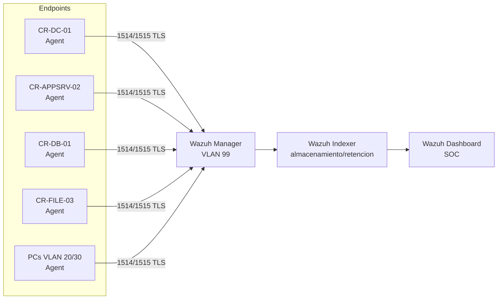

# Módulo 3 — Operaciones de Seguridad y Endpoints (SOC/SIEM)

> **Restricción de negocio:** presupuesto de licencias = **$0** (prohibido CrowdStrike,
> Splunk, etc.). Solución 100% Open Source de nivel empresarial: **Wazuh**.
> Marco de detección: **MITRE ATT&CK**. Enlaza con la retención de logs de la **Ley 81** (M6).

---

## 1. Plataforma elegida — Wazuh (EDR + SIEM Open Source)

**Wazuh** unifica EDR (agente en endpoint) y SIEM (correlación central) en un único stack
gratuito. (Alternativa evaluada: Elastic Security — descartada por mayor complejidad operativa
para el alcance de CREATIC.)

### Arquitectura de componentes (nombrada explícitamente)

| Componente Wazuh | Función | Ubicación |
|---|---|---|
| **Wazuh Manager** | Recibe eventos, aplica reglas de correlación, genera alertas | VLAN 99 (Gestión/SOC) |
| **Wazuh Agent** | Recolecta logs y telemetría en cada endpoint/servidor; FIM, detección de rootkits | CR-DC-01, CR-APPSRV-02, CR-DB-01, CR-FILE-03, equipos VLAN 20/30 |
| **Wazuh Indexer** | Almacena e indexa los eventos (búsqueda y retención) | VLAN 99 |
| **Wazuh Dashboard** | Visualización, paneles del SOC, gestión de alertas | VLAN 99 (acceso solo de administradores con MFA) |

---

## 2. Fuentes de ingesta (mínimo exigido + ampliación)

| Fuente | Activo | Cómo se ingiere |
|---|---|---|
| **Syslog** | CR-APPSRV-02, CR-DB-01 (Debian) | Agente Wazuh + lectura de `/var/log/auth.log`, `/var/log/syslog`, log de MySQL |
| **Windows Event Log** | CR-DC-01, CR-FILE-03 | Agente Wazuh (canal Security, System, Application) |
| Logs de aplicación | Apache (Portal Académico) | `access.log` / `error.log` vía agente |
| Logs del NGFW | OPNsense/Suricata | Syslog remoto hacia el Manager (alertas IPS/IDS) |
| Logs de autenticación | Keycloak (MFA) | Syslog/HTTP hacia el Manager |

> **Cobertura del inventario:** los 4 servidores envían Syslog/Windows Event al Manager,
> cumpliendo el mínimo exigido. La inclusión del NGFW y Keycloak da visibilidad de red e
> identidad (pilares CISA ZTMM Redes e Identidad).

---

## 3. Reglas de correlación / alertas (≥3 — aquí 4)

Implementadas en [`siem/reglas-correlacion.xml`](../siem/reglas-correlacion.xml).
Cada regla tiene **criterio de disparo** explícito y mapeo a **MITRE ATT&CK**:

| ID | Alerta | Criterio de disparo | MITRE | Nivel |
|---|---|---|---|---|
| 100010 | Fuerza bruta / credential stuffing SSH | ≥6 fallos de login SSH desde la misma IP en 120 s | T1110, T1078 | 10 |
| 100020 | Movimiento lateral a la BD de finanzas | Conexión a CR-DB-01:3306 desde un origen ≠ CR-APPSRV-02 | T1021, T1210 | 12 |
| 100030 | Uso/intento de SMBv1 | Evento Windows/IDS que referencia SMB1/SMBv1 (debió estar deshabilitado) | T1210, T1570 | 11 |
| 100040 | Creación de cuenta / elevación de privilegios | Windows Event 4720 (cuenta creada) o 4732 (añadido a grupo privilegiado) | T1136, T1098 | 10 |

> Las reglas **enganchan con la arquitectura**: la regla 100020 detecta exactamente la violación
> de la *matriz de flujos permitidos* del Módulo 2. Esto es deliberado: una alerta del SIEM debe
> corresponder a un control de diseño, no a un umbral arbitrario. (Clave para la defensa oral.)

---

## 4. Estrategia de visibilidad para BYOD (250 docentes contratistas)

Los equipos BYOD no admiten un agente gestionado por la institución de forma forzosa. Estrategia
en capas, coherente con Zero Trust (asumir la brecha):

1. **Sin agente = sin confianza:** por defecto, los BYOD entran a la **VLAN 40 en cuarentena**
   (ver M2). No se les concede acceso a la VLAN 10 sin superar el chequeo de postura.
2. **Visibilidad de red (sin agente):** el **NGFW/Suricata** inspecciona su tráfico L7 y envía
   alertas IPS/IDS al Wazuh Manager. Así hay telemetría aunque el dispositivo no tenga agente.
3. **Agente opcional para acceso ampliado:** a quien instale el agente Wazuh (multiplataforma) se
   le concede acceso condicional mayor; el agente reporta postura (parches, EDR, cifrado).
4. **Identidad como control:** Keycloak + MFA registra cada autenticación BYOD; la regla 100010
   también cubre intentos sospechosos desde estos dispositivos.

---

## 5. Retención de logs (enlaza con Ley 81 — Módulo 6)

El **Wazuh Indexer** retiene los eventos según la política definida en el Módulo 6 (conforme a la
Ley 81 de Panamá). Resumen técnico:

- Retención en caliente (búsqueda inmediata) y archivado comprimido para el plazo legal completo.
- Integridad de los logs (los registros de auditoría no deben poder alterarse) → soporta el valor
  probatorio ante la ANTAI.
- La implementación concreta (índices, *Index State Management*, cifrado del almacenamiento y
  plazos) se detalla en [`docs/M6-cumplimiento-ley81.md`](M6-cumplimiento-ley81.md).

---

## 6. Resumen de controles del Módulo 3 (para la matriz de trazabilidad)

- Stack SIEM/EDR Open Source → Wazuh (Manager/Agent/Indexer/Dashboard) → `siem/`
- Reglas de correlación → MITRE ATT&CK → `siem/reglas-correlacion.xml`
- Visibilidad BYOD → CISA ZTMM (Dispositivos/Visibilidad) → NGFW + agente opcional
- Retención de logs → Ley 81 → `docs/M6-cumplimiento-ley81.md`
</content>
