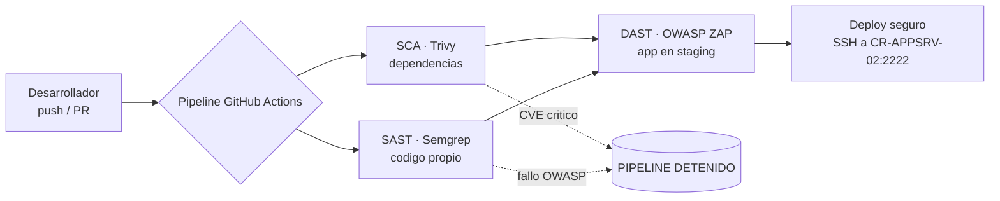

# Módulo 4 — Ciclo de Desarrollo Seguro (SecDevOps)

> **Peso en la rúbrica: 15%** (Estrategia SecDevOps y mitigación de vulnerabilidad).
> Marcos: **OWASP Top 10 / OWASP ASVS** y **CISA/NIST — Defending Against Software
> Supply Chain Attacks**. Pipeline implementado en [`cicd/pipeline.yml`](../cicd/pipeline.yml).

---

## 1. Problema de partida

CREATIC despliega el Portal Académico (CR-APPSRV-02) mediante **FTP/SCP manual**, con 3
desarrolladores, **sin pipelines** ni auditoría de código. Esto implica:

- No hay control de qué llega a producción ni quién lo subió (sin trazabilidad).
- Las vulnerabilidades (propias y de terceros) llegan a producción sin filtro.
- El canal FTP es inseguro (texto plano, sin integridad).

---

## 2. Solución — pipeline CI/CD con compuertas de seguridad (shift-left)

Se reemplaza el despliegue manual por un flujo automatizado en **GitHub Actions** con tres
análisis encadenados. Si cualquiera detecta algo crítico, el pipeline **falla** y el artefacto
**no llega** a CR-APPSRV-02.

| Etapa | Herramienta OSS | Qué analiza | Marco |
|---|---|---|---|
| **SCA** | Trivy (+ Dependabot) | Dependencias de terceros (CVEs conocidos) | CISA/NIST Supply Chain |
| **SAST** | Semgrep | Código fuente propio (inyección, XSS, secretos) | OWASP Top 10 / ASVS |
| **DAST** | OWASP ZAP | App desplegada en staging (caja negra) | OWASP ASVS |
| **Deploy** | SSH con clave (no FTP) | Publicación auditable a producción | — |

---

## 3. Inyección de emergencia — la vulnerabilidad RCE en la librería de PDF

**Escenario del profesor:** una librería de terceros para generar PDF en el Portal Académico
tiene una vulnerabilidad de **Ejecución Remota de Código (RCE)**.

### 3.1 Cómo el SCA lo previene (defensa en el pipeline)

1. **Detección automática:** el job `sca-dependencias` (Trivy) inspecciona los manifiestos de
   dependencias en **cada push/PR**. Al conocerse el CVE de la librería de PDF, Trivy lo marca
   como `CRITICAL`.
2. **Bloqueo (gate):** Trivy corre con `exit-code: 1` y umbral `CRITICAL,HIGH` → el pipeline
   **falla** y el build con la librería vulnerable **nunca se despliega** a CR-APPSRV-02.
3. **Remediación dirigida:** el reporte indica la versión segura; **Dependabot** abre
   automáticamente un PR de actualización. Tras actualizar, el SCA pasa y el flujo continúa.
4. **Prevención continua:** como el SCA corre en cada cambio, una dependencia que se vuelva
   vulnerable *después* (nuevo CVE) se detecta en el siguiente pipeline.

> Esto materializa la guía **CISA/NIST de cadena de suministro**: la seguridad de las
> dependencias se gestiona como parte del ciclo de vida, no como una revisión puntual.

### 3.2 Cómo la segmentación Zero Trust contiene el RCE (defensa en la arquitectura)

Supongamos que, pese al SCA, una versión vulnerable llega a producción y un atacante obtiene
**RCE en CR-APPSRV-02**. La arquitectura del Módulo 2 **impide que alcance la BD de finanzas
(CR-DB-01)**:

1. **Microsegmentación (VLAN 10 + matriz de flujos):** la única conexión saliente permitida desde
   CR-APPSRV-02 hacia CR-DB-01 es **3306/TCP**. El atacante no puede abrir SSH, RDP ni otros
   puertos hacia la BD ni hacia CR-DC-01.
2. **Regla de host (M5):** además de la VLAN, `ufw` en CR-DB-01 acepta 3306 **solo** desde
   `10.10.10.12` (CR-APPSRV-02). Cualquier intento de pivotar desde otra IP se deniega.
3. **Detección (M3):** si el atacante intenta escanear o conectar a la BD desde un origen
   anómalo, la **regla Wazuh 100020** dispara una alerta crítica de *movimiento lateral*.
4. **Datos cifrados (M5):** aunque tocara la BD por la ruta legítima, los datos están **cifrados
   en reposo** (InnoDB), reduciendo el valor de una exfiltración.
5. **Mínimo privilegio (NGFW egress):** el NGFW bloquea salidas a Internet por puertos arbitrarios,
   frenando el C2 y la exfiltración.

> **Resultado:** el RCE queda **contenido** en el segmento del servidor web. La cadena
> *prevención (SCA) → contención (segmentación) → detección (SIEM) → mitigación de impacto
> (cifrado)* es exactamente la **Defensa en Profundidad** que exige el proyecto, y es una
> respuesta lista para la **defensa oral** ante el incidente sorpresa.

---

## 4. Resumen de controles del Módulo 4 (para la matriz de trazabilidad)

- Pipeline CI/CD seguro → OWASP / CISA Supply Chain → `cicd/pipeline.yml`
- SCA del RCE → CISA/NIST Supply Chain → Trivy + Dependabot
- SAST/DAST → OWASP Top 10 / ASVS → Semgrep + OWASP ZAP
- Contención del RCE → NIST 800-207 (microsegmentación) → M2 (matriz de flujos) + M5 (ufw, cifrado) + M3 (regla 100020)
</content>
