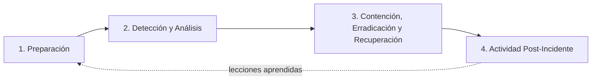

# Módulo 7 — Gestión de Riesgos y Respuesta a Incidentes

> **Peso en la rúbrica: 25%** (Sustentación Oral y Manejo de Incidentes bajo presión).
> Metodología de riesgos: **NIST SP 800-30 / ISO 27005**. Ciclo de respuesta:
> **NIST SP 800-61 Rev. 2**. Este módulo está diseñado para que cada acción de respuesta sea
> **rastreable** a un control de la arquitectura — requisito explícito de la defensa oral.

---

## 1. Metodología de la matriz de riesgos

Se aplica **NIST SP 800-30 / ISO 27005**. Cada riesgo se valora con:

- **Probabilidad (1–5):** 1 = muy improbable … 5 = casi seguro.
- **Impacto CIA (1–5):** mayor valor de afectación sobre Confidencialidad, Integridad o
  Disponibilidad del activo.
- **Riesgo Inherente = Probabilidad × Impacto** (escala 1–25), *antes* de aplicar controles.
- **Riesgo Residual:** valor *después* de aplicar el control propuesto.

Bandas: **1–5 Bajo · 6–11 Medio · 12–19 Alto · 20–25 Crítico**.

---

## 2. Matriz de riesgos (10 riesgos; ≥1 por cada activo del inventario)

| # | Activo | Amenaza | Vulnerabilidad | Prob (1-5) | Impacto CIA (1-5) | Riesgo Inherente | Control Propuesto (módulo) | Riesgo Residual |
|---|---|---|---|:--:|:--:|:--:|---|:--:|
| R1 | **CR-DC-01** | Ransomware / movimiento lateral | SMBv1 activo, sin parches | 4 | 5 | **20 Crítico** | Deshabilitar SMBv1 (M5) + microsegmentación (M2) + EDR Wazuh (M3) + backups | **8 Medio** (P2×I4) |
| R2 | **CR-DC-01** | Compromiso de credenciales de dominio | Sin MFA; credenciales en Dark Web | 4 | 5 | **20 Crítico** | MFA Keycloak (M2) + regla Wazuh 100040 (M3) + mínimo privilegio | **8 Medio** (P2×I4) |
| R3 | **CR-APPSRV-02** | RCE vía librería de PDF vulnerable | Dependencia de terceros sin control SCA | 4 | 4 | **16 Alto** | Pipeline SCA/SAST/DAST (M4) + Dependabot | **6 Medio** (P2×I3) |
| R4 | **CR-APPSRV-02** | Acceso no autorizado por SSH | SSH 22 con root y contraseña | 4 | 4 | **16 Alto** | Deshabilitar root + puerto 2222 + clave pública (M5) + regla 100010 (M3) | **3 Bajo** (P1×I3) |
| R5 | **CR-DB-01** | Exfiltración de finanzas/notas (mov. lateral) | Mismo segmento que el web | 4 | 5 | **20 Crítico** | Microsegmentación + ufw 3306 solo desde web (M2/M5) + regla 100020 (M3) | **6 Medio** (P2×I3) |
| R6 | **CR-DB-01** | Robo de datos en reposo | Sin cifrado at-rest | 3 | 5 | **15 Alto** | Cifrado InnoDB/LUKS (M5) | **4 Bajo** (P2×I2) |
| R7 | **CR-FILE-03** | Fuga de documentos administrativos | Permisos "Everyone/Todos" | 4 | 4 | **16 Alto** | Permisos mínimo privilegio vía icacls (M5) + segmentación (M2) | **6 Medio** (P2×I3) |
| R8 | **Red (toda)** | Propagación / movimiento lateral | Red plana sin VLANs ni IPS | 5 | 4 | **20 Crítico** | VLANs + NGFW OPNsense/Suricata IPS/IDS (M2) | **6 Medio** (P2×I3) |
| R9 | **Endpoints BYOD** | Dispositivo comprometido accede a recursos | BYOD sin control ni visibilidad | 4 | 4 | **16 Alto** | ZTNA + postura + cuarentena VLAN 40 (M2) + visibilidad NGFW (M3) | **6 Medio** (P2×I3) |
| R10 | **Usuarios (docentes)** | Spear-phishing → robo de credenciales | Sin MFA; falta de concienciación | 5 | 4 | **20 Crítico** | MFA resistente a phishing/WebAuthn (M2) + EDR (M3) + concienciación | **9 Medio** (P3×I3) |

> **Observación para la defensa:** ningún riesgo crítico queda sin reducir. Las reducciones de
> *Probabilidad* provienen de controles preventivos (MFA, hardening, segmentación) y las de
> *Impacto* del cifrado y la contención por microsegmentación.

---

## 3. Plan de Respuesta a Incidentes (IRP) — NIST SP 800-61 Rev. 2

### 3.1 Ciclo de vida (4 fases)

| Fase | Actividades en CREATIC | Apoyo de la arquitectura |
|---|---|---|
| **1. Preparación** | Roles CSIRT definidos, contactos ANTAI, runbooks, backups probados | Wazuh desplegado (M3), IRP documentado |
| **2. Detección y Análisis** | Triaje de alertas, confirmación, clasificación de severidad | Reglas de correlación Wazuh (M3), dashboards SOC |
| **3. Contención, Erradicación, Recuperación** | Aislar, eliminar la amenaza, restaurar desde backup limpio | Segmentación NGFW (M2), *active response* Wazuh, ZTNA/Keycloak |
| **4. Post-Incidente** | Informe, notificación ANTAI (Ley 81), lecciones aprendidas | Logs retenidos (M6) como evidencia |

### 3.2 Roles del CSIRT interno

| Rol | Responsabilidad principal |
|---|---|
| **Líder de Incidente (IC)** | Coordina la respuesta, decide la severidad y la activación del IRP |
| **Analista SOC** | Monitorea Wazuh, tria y valida alertas, ejecuta la contención técnica |
| **Responsable de Infraestructura** | Aplica aislamientos en NGFW/ZTNA, restaura sistemas y backups |
| **Responsable Legal/Comunicaciones** | Notifica a la ANTAI y a los titulares (Ley 81), gestiona la comunicación |

### 3.3 Métricas de gestión (KPIs/KRIs)

| Métrica | Definición | Objetivo CREATIC |
|---|---|---|
| **MTTD** (Tiempo Medio de Detección) | Desde que ocurre el evento hasta que el SOC lo detecta | Reducirlo con las reglas Wazuh (M3); objetivo **< 1 h** |
| **MTTR** (Tiempo Medio de Respuesta/Recuperación) | Desde la detección hasta la contención/recuperación | Objetivo **< 4 h** para incidentes críticos |

---

## 4. Playbook de contención rápida — listo para la defensa oral

La defensa inyectará un incidente sorpresa; hay que dar **3 acciones exactas** que **provengan
del propio IRP y arquitectura**. Esta tabla pre-mapea incidentes típicos a 3 acciones atómicas,
cada una rastreable a un control concreto:

| Incidente inyectado | Acción 1 (Contener) | Acción 2 (Cortar acceso) | Acción 3 (Detectar/Erradicar) |
|---|---|---|---|
| **Ransomware en CR-FILE-03** | Aislar la VLAN 10 en el **NGFW OPNsense** (bloquear este-oeste del host) | Revocar sesiones ZTNA y deshabilitar la cuenta afectada en **Keycloak** | *Active response* de **Wazuh** para matar proceso + bloquear IOC; restaurar desde backup |
| **Movimiento lateral hacia CR-DB-01** | Bloquear 3306 salvo CR-APPSRV-02 en **ufw/NGFW** (ya es la política base) | Aislar el host de origen en su VLAN y revocar su identidad | Investigar con la **regla Wazuh 100020** y los logs retenidos (M6) |
| **Credenciales admin comprometidas** | Forzar cierre de sesión y reset en **Keycloak** + exigir MFA | Revocar tokens ZTNA del usuario; bloquear su acceso a VLAN 10 | Revisar **regla 100040/100010** en Wazuh; rotar secretos |
| **RCE en el Portal Académico** | Sacar CR-APPSRV-02 de balanceo / aislarlo en VLAN 10 vía NGFW | Cortar egress a Internet del host (frenar C2) en el NGFW | Disparar el **pipeline SCA** (M4) para identificar y parchear la dependencia |

> **Mensaje para la junta (defensa):** "Cada acción de contención no es improvisada: sale de un
> control que ya diseñamos — una VLAN, una regla de Wazuh, una política de Keycloak o del NGFW.
> Eso es Zero Trust operando bajo presión."

---

## 5. Resumen de controles del Módulo 7 (para la matriz de trazabilidad)

- Matriz de riesgos → NIST 800-30 / ISO 27005 → §2
- IRP y ciclo de vida → NIST 800-61 Rev. 2 → §3
- Acciones de contención rastreables → M2 (NGFW/VLAN), M3 (Wazuh), M5 (ufw/cifrado) → §4
- Notificación de brechas → Ley 81 / ANTAI → M6
</content>
